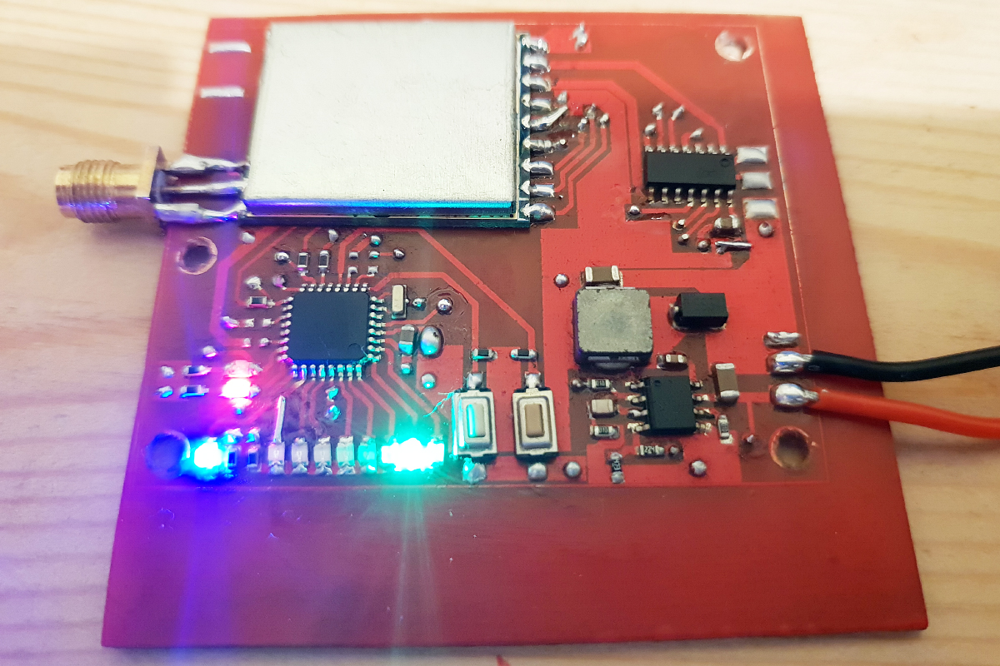

# FPV5.8diversity

This is a true-diversity 5.GHz video receiver for FPV.
The goal of the project is creating a diversity receiver module which is easy to mount on a non "fatshark socket" ("box" fpv goggles for example).
The module uses 2X BOSCAM RX5808 modules which are widely available and widely used for FPV application.

### Module requirements:
* one flat pcb
* powerd from 2s-6s battery
* analog vide and audio output for googles analog jack
* small size
* Frequency scan
* Two-botton user interface
* Discrete led frequency indication
* componets are large enough to solder by hand (typically not smaller than 0603)

## A prototype
A first version of the board has been (home) made and a basic firmaware is to be written.

The second rx module has not been connected since it is not needed at this point of development.

## RX5808 SPI control interface
The recievers modules have to be moded in order to enable SPI controll via the CH1, CH2, CH3 pins.
For furhter explanation check https://github.com/markohoepken/rx5808_pro_osd/wiki/rs5808-spi-patch
