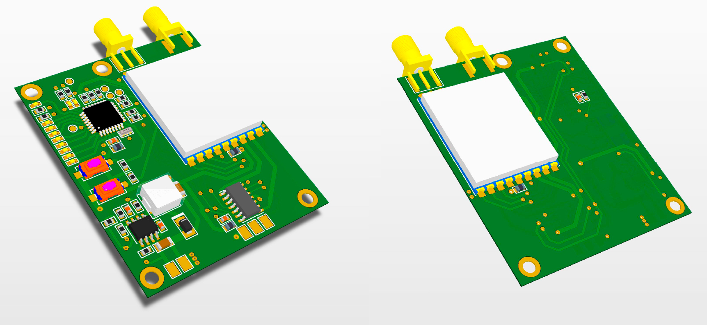

# FPV5.8diversity

This is a true-diversity 5.GHz video receiver for FPV.
The goal of the project is creating a diversity receiver module which is easy to mount on a non "fatshark socket" ("box" fpv goggles for example).
The module uses 2X BOSCAM RX5808 modules which are widely available and widely used for FPV application.

Module requirements:
* one flat pcb
* powerd from 2s-6s battery
* analog vide and audio output for googles analog jack
* small size
* Frequency scan
* Two-botton user interface
* Discrete led frequency indication
* componets are large enough to solder by hand (typically not smaller than 0603)

For now the focus is on the hardware development and once it is finished a firmware will be written.

